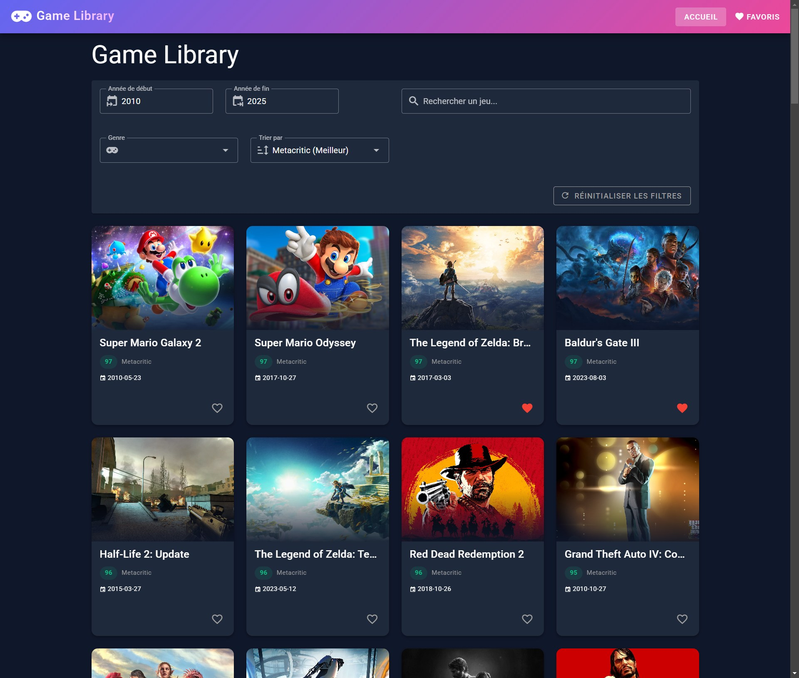

[](https://classroom.github.com/a/EBdR9AYf)

# Game Library - Projet Vue.js & Vuetify

## 1. Présentation du projet

### Concept
- **API choisie** : RAWG.io - Base de données de jeux vidéo avec 500 000+ titres
- **Public cible** : Joueurs cherchant à découvrir de nouveaux jeux et gérer leurs favoris
- **Objectifs** : Permettre de rechercher des jeux, consulter leurs détails (notes Metacritic, captures, vidéos) et créer une liste de favoris personnelle

### Fonctionnalités principales
- **Liste de jeux** avec images, scores Metacritic et dates de sortie  
- **Recherche** par nom de jeu  
- **Filtres** par genre (Action, RPG, etc.) et années (2010-2025 par défaut)  
- **Tri** par Metacritic, date de sortie, popularité, nom  
- **Pagination** pour naviguer entre les pages  
- **Page détails** avec description, galerie photos, vidéos, infos complètes  
- **Système de favoris** avec persistance localStorage  

### Aperçu visuel


---

## 2. Parcours d'apprentissage

### Ressources utilisées
- [Vue 3 Docs](https://vuejs.org/guide/introduction.html) - Composition API et réactivité
- [Vuetify 3 Docs](https://vuetifyjs.com/en/components/all/) - Composants UI
- [Pinia Docs](https://pinia.vuejs.org/) - Store et gestion d'état
- [RAWG API Docs](https://api.rawg.io/docs/) - Documentation de l'API
- Tutoriel Vue.js du cours + exercice Pokédex Vuetify

### Progression
- **Semaine 1** : Configuration projet, pages de base, routing
- **Semaine 2** : Intégration API, affichage liste, page détails
- **Semaine 3** : Recherche, filtres, tri, pagination, système favoris
- **Semaine 4** : Galerie photos/vidéos, scores Metacritic avec couleurs
- **Semaine 5** : Design moderne (thème sombre, animations, skeleton loader)

---

## 3. Outils et méthodologie

### Environnement de développement
- **IDE** : Visual Studio Code
- **Versioning** : GitHub
- **Stack** : Vue 3, Vuetify 3, Pinia, Vite
- **HTTP Client** : Fetch API
- **Gestion API Keys** : `.env` + `.env.example`

### Installation & Run
```bash
# Cloner le repo
git clone https://github.com/divtec-cejef/m294-projet-vuetify-micorytican98.git
cd m294-projet-vuetify-micorytican98

# Installer les dépendances
npm install

# Configurer la clé API
cp .env.example .env
# Éditer .env et ajouter votre clé RAWG.io

# Lancer en mode développement
npm run dev

```

**Obtenir une clé API** : Créer un compte sur https://rawg.io/

### Méthodologie
- Structure claire : pages, services, stores séparés
- Commits réguliers
- Tests manuels après chaque fonctionnalité
- Utilisation de Pinia pour l'état global (favoris)
- LocalStorage pour la persistance des données

### Choix techniques
- **API sélectionnée** : RAWG.io
- **Justification** : Documentation claire, données riches (images, vidéos, Metacritic)
- **Endpoints utilisés** : 
  - `/games` - Liste avec filtres et pagination
  - `/games/{id}` - Détails d'un jeu
  - `/games/{id}/screenshots` - Captures d'écran
  - `/games/{id}/movies` - Vidéos
  - `/genres` - Liste des genres
  - **Limites/quotas connus** : gratuit jusqu'à 20 000 requêtes/mois 

### Architecture
```
src/
├── layouts/default.vue      # Header avec navigation
├── pages/
│   ├── index.vue           # Liste des jeux
│   ├── game-[id].vue       # Détails d'un jeu
│   └── favorites.vue       # Jeux favoris
├── services/api.js         # Appels API RAWG
├── stores/favorites.js     # Store Pinia pour favoris
└── plugins/vuetify.js      # Configuration thème
```

**Data-flow** : Utilisateur → Event → Component → Service API → RAWG.io → Store Pinia → LocalStorage

---

## 4. Tests et validation

### Tests techniques
- Appels API fonctionnels (liste, détails, screenshots, vidéos)  
- Persistance vérifiée (favoris et années sauvegardés après refresh)  
- Navigation entre les pages fonctionnelle  
- Recherche, filtres et tri opérationnels  
- Pagination jusqu'à 25 pages  

### Tests d'UX
- Navigation intuitive (logo cliquable, boutons clairs)  
- Cartes entièrement cliquables pour voir détails  
- Filtres faciles à utiliser avec bouton de réinitialisation  
- Skeleton loader pendant chargement  
- Messages d'erreur clairs

### Tests d'accessibilité
- Contraste couleurs suffisant   
- Navigation clavier basique

### Tests d'erreurs & fallback
- Message d'erreur si API indisponible  
- "Aucun jeu trouvé" si recherche sans résultat  
- "Vous n'avez pas encore de favoris" si liste vide  
- Pas de mock fallback (amélioration future)  

---

## 5. Usage d'intelligence artificielle

### IA utilisée
- **Nom** : Claude (Anthropic)
- **Version** : Sonnet 4.5
- **Contexte** : Assistance au développement

### Utilisation détaillée
- **Aide au code général** : 65%
- **Génération de snippets Vue/Vuetify** : 65%
- **Aide à la structuration du projet** : 20%
- **Debugging** : 5%
- **Recherche d'idées** : 0%

### Compréhension et adaptation
J'ai lu et compris chaque bloc de code fourni par l'IA. Quand quelque chose n'était pas clair, j'ai posé des questions pour comprendre. J'ai testé manuellement chaque fonctionnalité après implémentation.

### Parties codées manuellement
- **Composants principaux** : 35%
- **Store & persistance** : 50% 
- **Tests & validation** : 100% 

### Apprentissage personnel
J'ai appris Vue 3 (Composition API), Vuetify 3, Pinia, les appels API asynchrones, localStorage, et Git. L'IA m'a permis d'avancer rapidement tout en comprenant les concepts.

---

## 6. Bilan personnel

### Ce que j'ai appris
- **Vue 3** : Réactivité avec ref(), hooks (onMounted), v-for, v-if, événements
- **Vuetify 3** : Composants Material Design, grille responsive, thème personnalisé
- **Pinia** : Store global, actions, persistance
- **API REST** : Fetch, async/await, gestion erreurs
- **LocalStorage** : Sauvegarde locale, JSON.stringify/parse

### Difficultés rencontrées
1. **Router dynamique** : Le format `[id]` dans le nom de fichier était nouveau. Solution : comprendre la syntaxe des routes dynamiques

### Réussites et fiertés
- Application moderne avec thème sombre et gradients
- Toutes les fonctionnalités demandées implémentées et fonctionnelles
- Attention aux détails (animations, skeleton loader, couleurs Metacritic)
- Code organisé avec commits réguliers

### Améliorations possibles
- Filtre par plateforme (PC, PlayStation, Xbox)
- Mode clair en plus du mode sombre
- Système de listes multiples (À jouer, En cours, Terminés)
- Notes personnelles sur chaque jeu

---

## 7. Références & Sources

### Documentation
- [RAWG.io API](https://api.rawg.io/docs/) - API des jeux vidéo
- [Vue 3](https://vuejs.org/) - Framework JavaScript
- [Vuetify 3](https://vuetifyjs.com/) - Composants Material Design
- [Pinia](https://pinia.vuejs.org/) - State management

### Outils
- Claude (Anthropic) - Assistant IA pour le développement
- Visual Studio Code - Éditeur
- GitHub - Versioning

---
